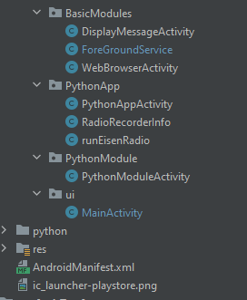
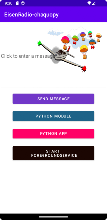

# EisenRadio-chaquopy

## Overview

This repository shows the source code of an Android application with Python package 
[EisenRadio](https://github.com/44xtc44/EisenRadio)
as backend.

Java / Python calls with Chaquopy plugin for Gradle. https://github.com/chaquo/chaquopy

<table style="padding:10px">
<tr>
  <td>
      
  </td>
    
  <td>
      
  </td>

  <td>
      
* Java TextView 

* Single Python module

* Python backend

* Java ForeGroundService

  </td>
</tr>
</table>

## Running the project

Install latest Android Studio.

Start a virtual device (AVD) and enable the preinstalled Browser, not Viewer. 

Enable Notifications in the "Settings" app or menu.

## How it works

* [DisplayMessageActivity.java](https://github.com/44xtc44/EisenRadio-chaquopy/blob/dev/app/src/main/java/com/hornr/BasicModules/DisplayMessageActivity.java) -
Warmup with a Java TextView that sends a message to another activity. See the link to a complete tutorial in the comment.

* [PythonModuleActivity.java](https://github.com/44xtc44/EisenRadio-chaquopy/blob/dev/app/src/main/java/com/hornr/PythonModule/PythonModuleActivity.java) -
A Python module call shows how to send Python returns to the Java interpreter via JSON.

* [PythonApp](https://github.com/44xtc44/EisenRadio-chaquopy/tree/dev/app/src/main/java/com/hornr/PythonApp) -
A Python backend runs as a foreground promoted service on Android. Frontend is an automatic started Browser.

  * [runEisenRadio.java](https://github.com/44xtc44/EisenRadio-chaquopy/blob/dev/app/src/main/java/com/hornr/PythonApp/runEisenRadio.java) -
  ForeGroundService has to implement a notification routine, which is realized as a Java Callable.

  * [RadioRecorderInfo.java](https://github.com/44xtc44/EisenRadio-chaquopy/blob/dev/app/src/main/java/com/hornr/PythonApp/RadioRecorderInfo.java) -
  Access the localhost network to request App information JavaScript AJAX style with a Java Callable and Feature combo.

  * [PythonAppActivity.java](https://github.com/44xtc44/EisenRadio-chaquopy/blob/dev/app/src/main/java/com/hornr/PythonApp/PythonAppActivity.java) -
  Deal with the new multi-access Permissions. We must send a user request for access, denial each time we start a "dangerous" action like camera or SD card access.

* [ForeGroundService.java](https://github.com/44xtc44/EisenRadio-chaquopy/blob/dev/app/src/main/java/com/hornr/BasicModules/ForeGroundService.java) -
An idle ForeGroundService to show its implementation.

## Thank you

[AssetExtractor](https://github.com/joaoventura/pybridge/blob/master/PyApp/app/src/main/java/com/jventura/pybridge/AssetExtractor.java)
https://github.com/joaoventura/pybridge

## License

MIT
